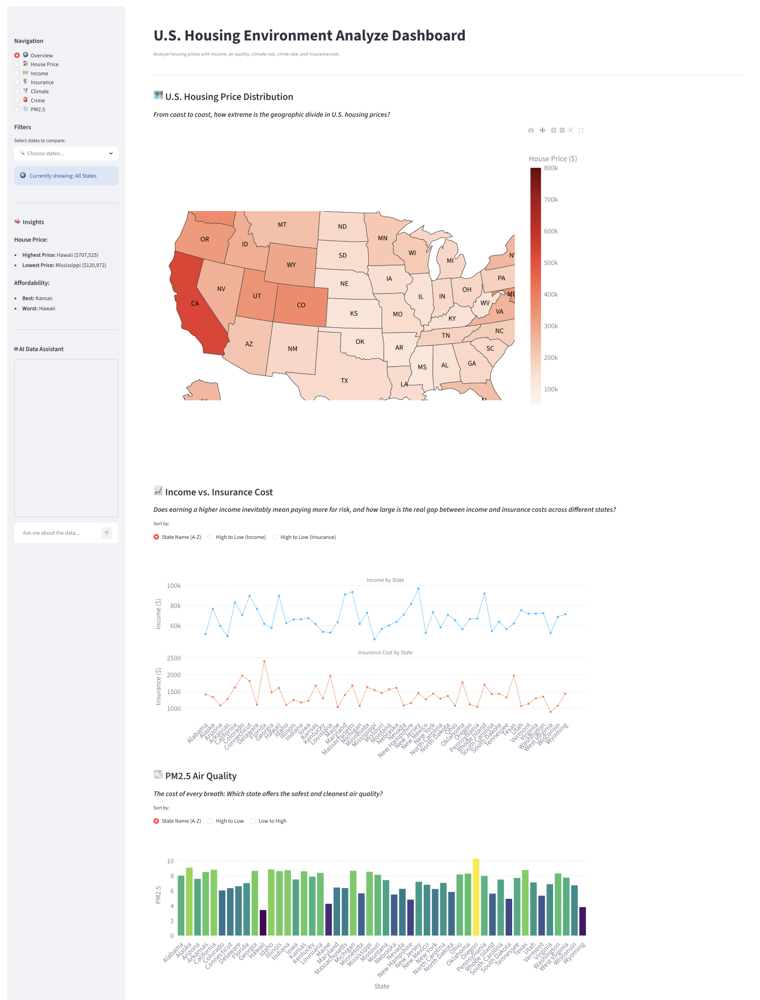

# Housing Analytics Dashboard

An interactive housing analytics dashboard built with Python and Streamlit for analyzing housing affordability, environmental risks, and demographic trends across the United States.

This project integrates multiple public datasets to provide data-driven insights into housing markets, environmental conditions, and regional risk factors. Users can compare states and explore relationships between housing prices, income levels, crime rates, air quality, and natural disaster events.

---

## Dashboard Preview



---

## Project Objectives

The goal of this project is to help users evaluate housing markets across different U.S. states by combining economic, environmental, and demographic indicators into a single analytical platform.

Key questions addressed:

- Which states have the most affordable housing?
- How do housing prices compare to household income?
- What environmental risks exist in different regions?
- How do crime rates and disaster frequency affect housing decisions?
- Which states offer the best overall balance between affordability and quality of life?

---

## Features

### Housing Affordability Analysis

- Compare median home values across states
- Analyze median household income
- Calculate and visualize price-to-income ratios
- Identify housing affordability trends

### Environmental Risk Analysis

- Integrate PM2.5 air quality data
- Compare environmental conditions across states
- Analyze long-term environmental exposure trends

### Disaster Risk Assessment

- Integrate FEMA disaster declaration data
- Visualize disaster frequency by state
- Compare climate-related risk factors

### Interactive Dashboard

- Select and compare multiple states
- Dynamic filtering and visualization
- Interactive charts and data exploration
- Real-time dashboard updates

---

## Data Sources

### U.S. Census Bureau API

Provides:

- Median Home Value
- Median Household Income
- Population Data

### EPA Air Quality System (AQS) API

Provides:

- PM2.5 Air Quality Measurements

### FEMA Open Data API

Provides:

- Disaster Declaration Records
- Disaster Event Frequency

---

## Technologies Used

### Programming

- Python

### Data Processing

- Pandas
- NumPy

### Visualization

- Streamlit
- Plotly

### APIs

- U.S. Census API
- EPA AQS API
- FEMA Open Data API

---

## Project Architecture

```text
Census API
      │
EPA API
      │
FEMA API
      ▼
Data Collection
      ▼
Data Cleaning
      ▼
Data Integration
      ▼
Analytics Engine
      ▼
Streamlit Dashboard
```

---

## Key Metrics

The dashboard analyzes:

- Median Home Value
- Median Household Income
- Price-to-Income Ratio
- Population
- PM2.5 Air Quality
- Crime Indicators
- Disaster Event Frequency

---

## Project Structure

```text
housing-analytics-dashboard/
│
├── app.py
├── final_dataset.csv
├── datasets/
├── screenshots/
│   └── dashboard.png
├── requirements.txt
└── README.md
```

---

## Team Project

This project was developed as a team project as part of a graduate-level data analytics course.

### My Contributions

- Collected and integrated public datasets from Census, EPA, and FEMA APIs
- Performed data cleaning and preprocessing using Python and Pandas
- Contributed to dashboard development using Streamlit
- Designed data visualizations and state-level comparison features
- Assisted in data analysis and business insight generation

---

## Skills Demonstrated

- Data Analysis
- Data Cleaning
- Data Visualization
- Dashboard Development
- API Integration
- Exploratory Data Analysis (EDA)
- Business Intelligence Reporting
- Public Data Analytics

---

## Future Improvements

- County-level analysis
- Housing market forecasting
- Machine learning price prediction
- Additional environmental indicators
- User-customized dashboards

---

## Authors

Yu-Tai Lee (Darren)  
Cheng-Han Chung

Master of Science in Computer Science  
University of the Pacific

GitHub: https://github.com/Darren-YT
